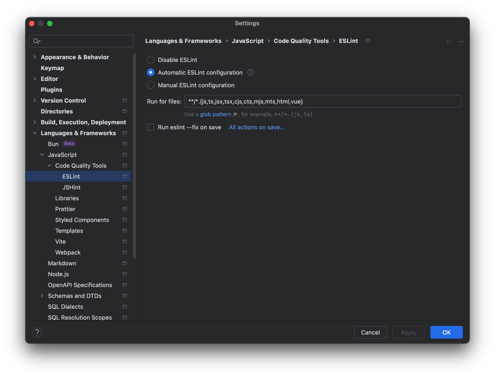
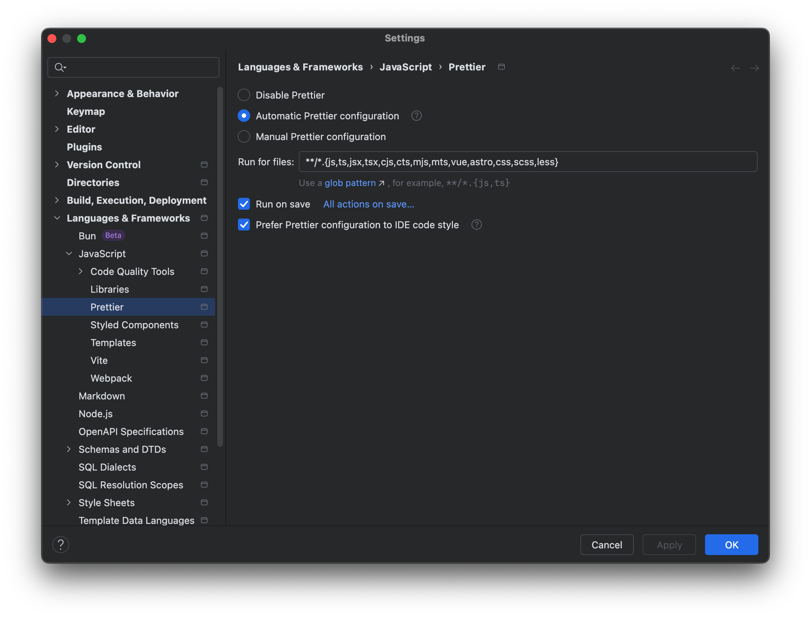
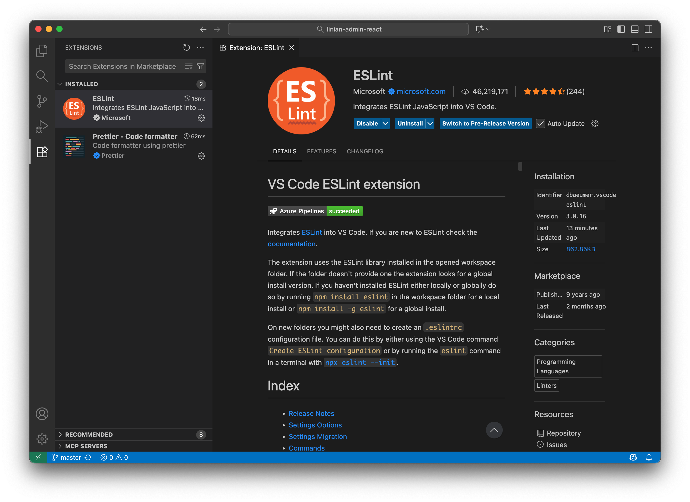
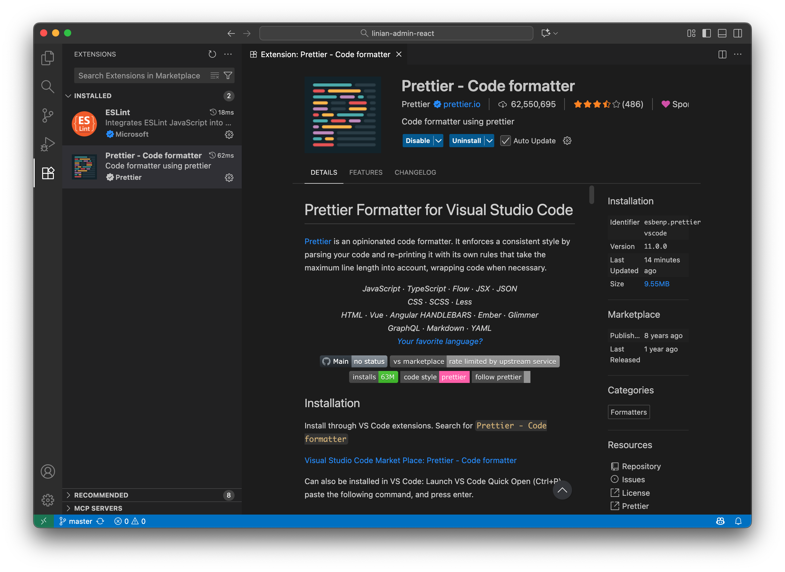

# 编辑器配置

## Eslint 和 Prettier

本项目通过 **Eslint**、**Prettier** 管控代码质量、统一编码风格(包括 js 和 css)，请在编辑器中安装并开启相关插件。

:::warning

非项目管理员禁止修改 eslint.config.js 和 .prettierrc.js 文件

:::

### WebStorm 配置

#### Eslint 插件配置



#### Prettier 插件配置



⚠️ 注意：Run for files 需要指定 css、less、scss 文件，否则 Prettier 不会对 css 生效。

```
**/*.{js,ts,jsx,tsx,cjs,cts,mjs,mts,vue,astro,css,scss,less}
```

### Visual Studio Code 配置

#### Eslint 插件配置



⚠️ 注意：不要在保存时自动修复 eslint 错误。

```json
{
  "editor.codeActionsOnSave": {
    "source.fixAll.eslint": false
  },
}
```

#### Prettier 插件配置



修改配置文件，开启保存时自动格式化代码：

```json
{
  // 保存时自动格式化
  "editor.formatOnSave": true,
  // 设置 Prettier 为默认格式化工具
  "editor.defaultFormatter": "esbenp.prettier-vscode",
}
```

